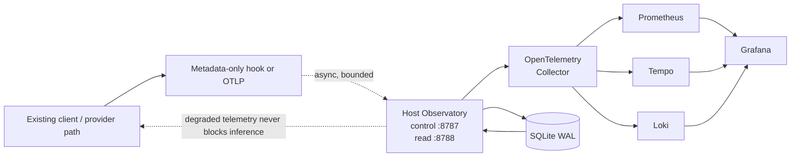

<div align="center">

# LLM Observatory

<p><strong>Metadata-first observability for LLM-assisted development.</strong></p>

<p>
  See models, sessions, projects, agents, workflows, outcomes, cost, latency, and reliability<br />
  without turning the Observatory into an inference proxy, credential store, or provider gateway.
</p>

<p>
  <a href="https://github.com/markwuenschel-dev/LLM-Observatory"></a>
  <a href="pyproject.toml"></a>
  <a href="tests/"></a>
  <a href="https://github.com/markwuenschel-dev/LLM-Observatory/commits/main"></a>
</p>

<p>
  <a href="https://opentelemetry.io/"></a>
  <a href="https://docs.docker.com/compose/"></a>
  <a href="https://www.sqlite.org/wal.html"></a>
  <a href="https://prometheus.io/"></a>
  <a href="https://grafana.com/oss/tempo/"></a>
  <a href="https://grafana.com/oss/loki/"></a>
  <a href="https://grafana.com/"></a>
  <a href="docs/privacy.md"></a>
  <a href="docs/architecture.md"></a>
</p>

<p>
  <a href="#quick-start">Quick start</a> ·
  <a href="#architecture">Architecture</a> ·
  <a href="#connect-your-clients">Connect clients</a> ·
  <a href="docs/operations.md">Operations</a> ·
  <a href="docs/production-readiness.md">Readiness</a>
</p>

</div>

> LLM Observatory is an external observation plane for AI-assisted engineering. It collects bounded, privacy-safe metadata from existing client paths and makes it queryable locally. Normal inference continues through the provider and client route it already uses.

## At a glance

| Observe | Keep out by default | Never change |
| --- | --- | --- |
| Provider and model identity, project and branch, sessions and traces, agents and workflows, usage, latency, reliability, and explicit engineering outcomes | Prompts, completions, secrets, credentials, raw filesystem paths, sensitive tool values, and raw activity payloads | Provider URLs, credentials, request payloads, inference routing, and client exit paths |

## Architecture

The core invariant is simple: telemetry is asynchronous, bounded, and disposable from the point of view of inference.



The host-native API keeps control and intake on `8787`, while bounded dashboard reads use `8788`. Docker reaches those endpoints through `host.docker.internal`; generated API and Grafana secrets live under the user state directory, never in an observed repository.

## Why it exists

- Compare model, provider, client, project, session, workflow, skill, and agent behavior in one local view.
- Correlate usage, latency, cost, reliability, tests, builds, commits, and reviews without claiming causation.
- Start with synthetic metadata, then add explicitly authorized native client telemetry.
- Keep observability failure isolated: a full queue, unavailable Collector, degraded store, or unavailable dashboard must not redirect inference.

## Quick start

The provider-free demo seeds synthetic metadata and is safe to run before connecting a real client.

### Windows PowerShell

Install Python 3.14+ and Docker Desktop in Linux-container/WSL2 mode, then run from the checkout:

```powershell
cd C:\Users\Nalakram\Documents\GitHub\LLM-Observatory
$state = "$env:LOCALAPPDATA\LLM-Observatory"

uvx --python 3.14 --from . observatory --state-dir $state install --demo
uvx --python 3.14 --from . observatory --state-dir $state doctor
uvx --python 3.14 --from . observatory --state-dir $state start
uvx --python 3.14 --from . observatory open
```

Open the local surfaces:

| Surface | URL |
| --- | --- |
| Grafana | [127.0.0.1:3000](http://127.0.0.1:3000) |
| Control API health | [127.0.0.1:8787/healthz](http://127.0.0.1:8787/healthz) |
| Read API readiness | [127.0.0.1:8788/readz](http://127.0.0.1:8788/readz) |
| OTLP gRPC / HTTP | `127.0.0.1:4317` / `127.0.0.1:4318` |
| Collector health | `127.0.0.1:13133` |

The generated state directory contains the host-native SQLite database, bounded spool, Compose environment, Grafana secret, and API bearer-token files. It is never created inside an observed repository.

### Editable development install

```powershell
$state = "$env:LOCALAPPDATA\LLM-Observatory"
uv python install 3.14
uv venv --python 3.14
.\.venv\Scripts\Activate.ps1
uv pip install -e .
observatory --state-dir $state install
```

## Send a first event set

Use the checked-in synthetic fixture to exercise ingestion without provider credentials:

```powershell
uvx --python 3.14 --from . observatory --state-dir $state ingest `
  --file .\examples\synthetic-events.jsonl --offline
uvx --python 3.14 --from . observatory --state-dir $state flush --offline
uvx --python 3.14 --from . observatory --state-dir $state status
```

JSONL records require `schema_version`, `event_id`, `event_type`, and a timezone-aware `observed_at`. Unknown provider and model values are valid. The default path redacts sensitive fields before persistence and API delivery.

## Connect your clients

The Observatory does not replace a client’s subscription or API path. Configure only the client-level telemetry surface you have explicitly reviewed.

| Client surface | Current posture |
| --- | --- |
| Claude Code, Codex, Gemini | Documented global OTLP settings; opt-in configuration |
| Kimi, Grok | Marked global observation hooks through the fail-open adapter |
| Cursor | Adapter-only until a verified global hook or OTLP contract exists |
| Direct APIs and OpenRouter | Caller-owned response adapters; no mandatory proxy |

```powershell
uvx --python 3.14 --from . observatory --state-dir $state configure claude --apply --traces
uvx --python 3.14 --from . observatory --state-dir $state configure codex --apply --traces
uvx --python 3.14 --from . observatory --state-dir $state configure gemini --apply --traces
uvx --python 3.14 --from . observatory --state-dir $state configure kimi --apply
uvx --python 3.14 --from . observatory --state-dir $state configure grok --apply
```

Review a plan without changing user files by omitting `--apply`. A real-client acceptance run requires an operator-authorized client command; the harness never runs a provider command automatically.

## Operate it safely

```powershell
observatory --state-dir $state status
observatory --state-dir $state retention --prometheus-days 30 --tempo-hours 720 --loki-hours 336
observatory --state-dir $state backup "$env:USERPROFILE\LLM-Observatory-state.zip" --full-state
observatory --state-dir $state record-outcome --kind tests --status passed --correlation-id run-123 --offline
observatory --state-dir $state run-outcome --kind tests --offline -- python -m unittest
observatory --state-dir $state stop
```

Do not use `docker compose down -v` during normal operation: it deletes durable telemetry and dashboard volumes. For stale generated Compose state, use the audited recovery sequence in [Operations and recovery](docs/operations.md).

## Verify the repository

```powershell
$env:PYTHONPATH = 'src'
python -m unittest discover -s tests -p "test_*.py"
python scripts/verify.py
docker compose --env-file "$env:LOCALAPPDATA\LLM-Observatory\compose.env" config
```

The local unit suite currently reports 198 passing tests and the static verifier reports no failures. The disposable runtime gate covers service startup, query, privacy, recovery, and failure isolation; it does not replace a real-client telemetry run, human dashboard review, off-host encrypted recovery, host reboot proof, or signed-image promotion.

## Documentation

| Guide | Use it for |
| --- | --- |
| [Architecture](docs/architecture.md) | Durable invariants, signal roles, attribution, and known limits |
| [Operations and recovery](docs/operations.md) | Install, lifecycle, retention, backups, upgrades, and failure isolation |
| [Privacy boundary](docs/privacy.md) | Default redaction, allowlists, pseudonymous project identity, and content-capture rules |
| [Capability evidence](docs/capability-evidence.md) | Client-specific telemetry evidence and adapter posture |
| [Production readiness](docs/production-readiness.md) | Remaining deployment and promotion gates |
| [Foundation plan](docs/superpowers/plans/2026-08-07-llm-observatory-foundation.md) | The current implementation plan and design record |

## Status

This is an active, production-oriented foundation. The repository does not currently declare a license file, and production sign-off remains gated on the explicit evidence listed in [Production readiness](docs/production-readiness.md).
